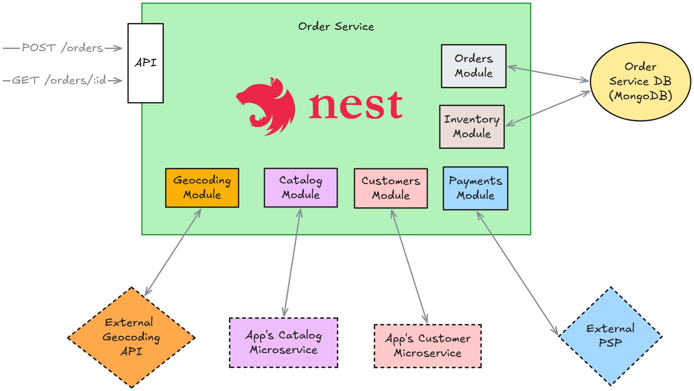
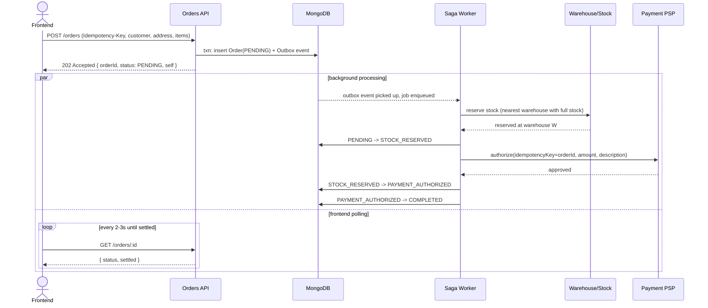
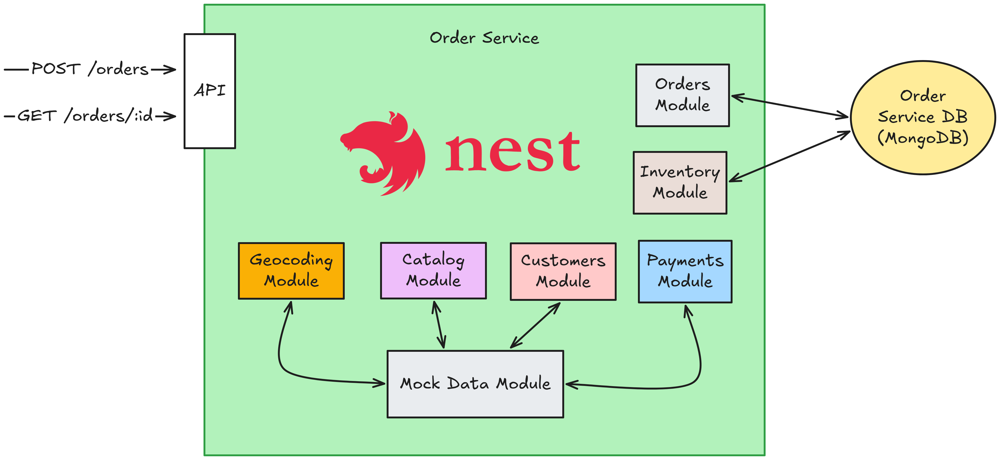

# Orders Service

Backend implementation of the Canals take-home order-management API: `POST /orders`
picks the nearest warehouse able to fill the order and charges the customer, built to
survive dropped connections, retried requests, and redelivered background jobs without
double-charging or double-decrementing stock.

## Try it out live!

A running instance is available at
[http://ec2-54-90-112-209.compute-1.amazonaws.com:8080](http://ec2-54-90-112-209.compute-1.amazonaws.com:8080).

## Running it

### Docker (simplest)

Brings up an already-initialized MongoDB replica set, Redis, the API (which also runs
the saga worker, outbox relay, and reconciliation sweeper in-process, per §2), and the
static frontend — no local Mongo/Redis install, no `.env` needed for the default setup:

```bash
docker compose up --build
```

- API: `http://localhost:4000`
- Frontend: `http://localhost:8080`

`docker compose down` stops everything and keeps the Mongo volume; add `-v` to wipe it.

### Manual

MongoDB must run as a replica set (the reservation/release logic uses multi-document
transactions) and Redis is required for the background job queue. See `.env.example`
for every setting. Use this path instead of Docker when you want `npm run start:dev`
hot-reload during development.

```bash
mongod --replSet rs0 --dbpath /your/data/path
mongosh --eval 'rs.initiate()'

npm install
cp .env.example .env
npm run start:dev
```

## 1. Environment assumptions & architecture

This service is written as if it were one participant in a larger e-commerce platform,
not the whole platform:

- **Customer/user data** lives in a separate customer service, reached over HTTP.
- **Product/catalog data** (existence, pricing) lives in a separate catalog service,
  reached over HTTP.
- **Geocoding** (shipping address → lat/lng) is a third-party API, reached over HTTP.
- **Payments** are handled by an external PSP, reached over HTTP, given only a card
  number, amount, and description — this service never stores card data.
- **This "orders" service** owns two things that the take-home explicitly scoped to a
  single service:
  1. choosing, for a given order, the nearest warehouse that can fill it, and
  2. running the order lifecycle — reserve stock, charge the card, settle — as an
     idempotent process that survives crashes and retries.

  Warehouse/stock selection and order-lifecycle orchestration are arguably two
  different bounded contexts (inventory vs. order orchestration), and in a real system
  I'd likely split them. I kept them in one service here because the assignment asked
  for a single order-management API and splitting it would have added infrastructure
  (another deployable, another network hop) without adding anything the reviewer asked
  to see.



`POST /orders` itself only talks to Customer/Catalog/Geocoding — synchronously, on the
request path, to validate and price the order and to freeze its shipping coordinates.
The PSP is only ever called later, asynchronously, by the saga worker. This split is
what makes the API response fast and makes the payment step retriable independently of
the request/response cycle (see §2).

## 2. The ordering process

### Why it's asynchronous

`POST /orders` returns **`202 Accepted`** immediately, with the order in `PENDING`
status and a `self` link — it does not wait for stock to be reserved or the card to be
charged before responding.

This is deliberate, not incidental:

- Reserving stock and charging a card both require calling into other systems
  (inventory selection touches the database in a transaction; payment is a third-party
  HTTP call to a PSP). If any of that ran synchronously inside the request and the
  client's connection dropped mid-flight — a mobile client losing signal, a proxy
  timeout — the client would have no idea whether the order (and the charge!) actually
  went through, and a naive retry could double-charge the customer. Making the API
  call itself cheap and idempotent (see the idempotency-key handling below), and doing
  the risky work in a background job that keeps retrying until it durably succeeds or
  durably fails, removes that failure mode entirely: the order's fate no longer depends
  on the frontend's connection staying alive.
- It decouples the request's latency from the latency of two external systems (PSP,
  geocoding-adjacent inventory lookups) that this service doesn't control.

### How the frontend is meant to consume it

Because the order isn't settled when the API responds, the frontend polls for the
result using a second endpoint added for exactly this purpose:

```
GET /orders/:id
```

which returns the order's current `status`, a computed `settled` boolean, and (once
available) the assigned warehouse, payment result, or failure reason. The `202`
response from `POST /orders` includes a `self` link pointing at this endpoint, so the
frontend doesn't need to construct the URL itself.

I chose polling (every 2–3 seconds is plenty) over a push mechanism like Server-Sent
Events or WebSockets. Real-time delivery isn't a requirement here — nobody needs to
watch a stock reservation happen millisecond by millisecond — and a push mechanism
would require this service to hold open connections and track which client cares about
which order, which is state this service would otherwise never need to keep. Polling
keeps the backend fully stateless with respect to "who is watching," at the cost of a
few seconds of latency in the UI, which is a trade I'll take for an order-confirmation
screen.

### High-level flow — happy path

1. Frontend submits `POST /orders` with a customer, shipping address, items, and an
   `Idempotency-Key` header.
2. The service validates the customer, prices the items against the catalog, geocodes
   the shipping address, and durably records the order as `PENDING` — then responds
   `202` with the order id.
3. In the background, a worker picks up the new order and:
   a. Finds the nearest warehouse that can fill the whole order and reserves the stock
      there → order becomes `STOCK_RESERVED`.
   b. Authorizes a charge against the customer's card for the order total → order
      becomes `PAYMENT_AUTHORIZED`.
   c. Marks the order `COMPLETED` (terminal).
4. The frontend, polling `GET /orders/:id`, sees the status progress and stops once
   `settled` is `true`.



### Failure paths

**No warehouse has enough stock.** The worker searches every candidate warehouse
(nearest first) and finds none that can fill the full order. Nothing was ever reserved
or charged, so there's nothing to undo: the order moves straight `PENDING → FAILED`
(terminal) with a machine-readable reason the frontend can show to the customer.

**The card is declined (insufficient funds, etc.).** By this point stock has already
been reserved at a warehouse, so simply failing the order would silently strand that
inventory. The order moves to an explicit `COMPENSATING` state, the worker releases the
reserved stock back to the warehouse, and only then does the order settle at
`COMPENSATED` (terminal). `COMPENSATING` is a real, persisted state rather than an
implicit consequence of "declined" — that way, if the process crashes mid-release, the
next worker (or the reconciliation sweep) can see that a release is still owed and
finish it, instead of the stock being lost until someone notices by hand.

Both terminal-failure states are surfaced to the frontend the same way as success: keep
polling `GET /orders/:id` until `settled` is `true`, then read `status` and
`failureCode`.

## 3. Finding the nearest available warehouse

Given the order's shipping coordinates (resolved via geocoding) and its list of
requested products/quantities, the goal is: among warehouses that can fill the *entire*
order from their own stock, pick the closest one — and if that warehouse's stock turns
out to have moved by the time we actually try to take it, fall back to the next
closest.

**Data model / indexes:**
- `Warehouse.location` is a GeoJSON `Point`, indexed with a **`2dsphere`** index —
  this is what makes "nearest to a point" queryable at all in MongoDB, and it's the
  index a `$geoNear` aggregation stage requires.
- `Stock` has one document per `(warehouseId, productId)` pair, with a **unique
  compound index on `{warehouseId, productId}`** — this both prevents duplicate stock
  rows and gives point-lookups for "how much of product P does warehouse W have" for
  free.

**The query, step by step:**

1. A single aggregation against the `warehouses` collection:
   - `$geoNear` with the order's coordinates as the `near` point — this stage uses the
     `2dsphere` index and, as a side effect of how `$geoNear` works, always returns
     warehouses **already sorted nearest-first**, so no separate `$sort` is needed.
   - `$lookup` against `stock`, joined on `warehouseId`, filtered to just the
     requested `productId`s — this attaches each warehouse's relevant stock rows
     without pulling its entire inventory.
2. In application code, the joined results are filtered down to warehouses that have
   *every* requested product in *sufficient* quantity — a warehouse missing even one
   item, or short on quantity for one item, is dropped. Because step 1 already sorted
   by distance and filtering preserves order, the surviving list is still nearest-first.
3. The candidates are then tried **one at a time, nearest first**, inside a database
   transaction: the reservation records "we're taking this stock for this order" first,
   then decrements each item's quantity with a conditional update (`quantity: {$gte:
   requestedQty}` in the filter). If the decrement doesn't match — because another
   order took that stock in the meantime — the transaction aborts and the next-nearest
   candidate is tried instead.

The reason step 2's filtering and step 3's transactional attempt are split like this
rather than combined into one aggregation: `$geoNear` cannot run inside a multi-document
transaction in MongoDB, so ranking by distance has to happen as a plain read outside
any transaction. That means the ranking step is only ever a *hint* — read-only,
possibly slightly stale by the time we act on it. The actual correctness guarantee
("we never oversell this warehouse's stock") lives entirely in the conditional
decrement inside the transaction, which will simply refuse and let the code fall
through to the next candidate if the stock it was promised has already moved. If no
candidate can fill the order, the order fails as described in §2.

## 4. The mockdata module

The task calls for mocking geocoding and the payment API, and explicitly says there's
no need to implement customer/catalog/warehouse management APIs. Rather than hardcoding
fixture data for those, I built a small module (`src/mockdata`) that implements REST
endpoints standing in for *all* of the external systems this service depends on:
the PSP, the product catalog, the geocoder, and the customer directory — plus
management endpoints for warehouses and stock, since those needed to exist somewhere
for the order flow to have anything to reserve against.

Why a module instead of static fixtures: it gave me (and would give a frontend) a
single, running, HTTP-addressable place to add, list, and remove mock records —
customers, products, addresses/coordinates, warehouses, stock levels, and even
credit-card numbers pinned to always approve or always decline — while the app is
running, instead of editing seed data and restarting. It's also what let me exercise
the failure paths in §2 on demand: the mock PSP can simulate a decline, and can
simulate a charge succeeding on its end while the response is lost in transit, which is
what the reconciliation sweep exists to recover from.

Each real integration point (`PaymentService`, `CatalogService`, `GeocodingService`,
`CustomersService`) talks to its counterpart the same way it would talk to a genuine
third-party provider — a plain HTTP call to a configured base URL — and that base URL
defaults to this mock module locally but is independently overridable per integration
via an environment variable. Swapping any one of them for a real provider later is a
config change, not a code change. Warehouses and stock are the one exception: since
this service owns that data directly rather than fetching it from another system, the
mock module's warehouse/stock endpoints write to the exact same collections the real
reservation logic reads from, so a warehouse or stock level added through the mock
module's CRUD endpoints is immediately usable by a real order.

This module is explicitly a development/testing aid, not something meant to ship to
production — it stands in for infrastructure a real deployment would never own itself
(another company's payment gateway, another team's customer service).



## Testing

```bash
npm test         # unit — fast, no I/O
npm run test:int # integration — real transactions against an in-memory replica set
```
